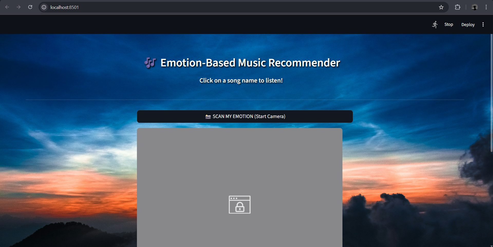
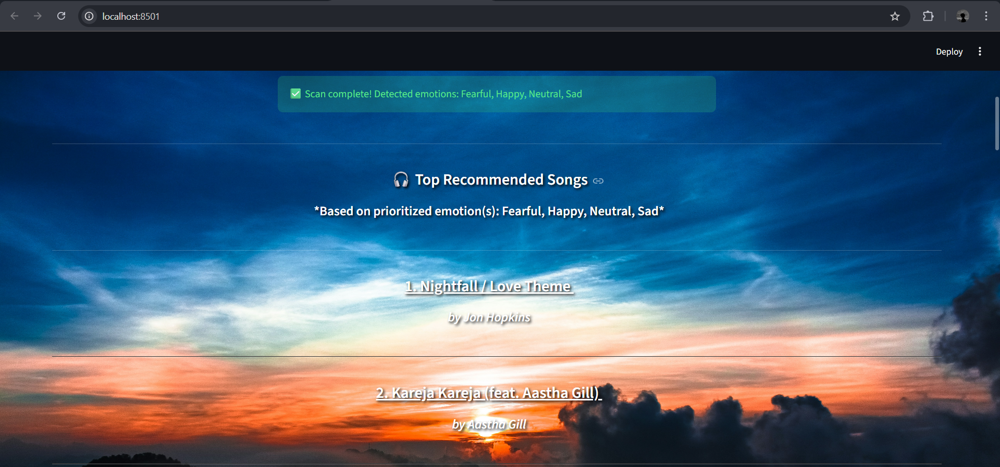

# Emotion-Based Music Recommendation System 🎶

This application detects a user’s facial emotion using real-time webcam input and recommends music based on emotional state. It combines computer vision (OpenCV), deep learning (TensorFlow/Keras), and a Streamlit UI.

---

## 📸 Example Screenshots

### App Home UI


### Emotion Detection (Camera Active)



### Music Recommendation Output



---

## ✨ Features

- Real-time facial emotion detection via Haar Cascade
- CNN-based 7-emotion classification
- Emotion → Music mapping across 5 emotional categories
- Efficient song sampling
- Clean Streamlit interface
- Uses session-state caching for performance

---

## 📁 Project Structure

Emotion-based-music-recommendation-system/
│
├── app.py
├── requirements.txt
├── muse_v3.csv
├── model.h5
├── haarcascade_frontalface_default.xml
│
└── assets/
├── main.png
├── scan.png
└── output.png

— this is the version you should paste into your README.

---

## 🖥️ Setup Instructions

### 1️⃣ Create virtual environment

**Windows:**

```bash
python -m venv venv
macOS/Linux:

bash
Copy code
python3 -m venv venv
2️⃣ Activate the environment
Windows:

bash
Copy code
venv\Scripts\activate
macOS/Linux:

bash
Copy code
source venv/bin/activate
3️⃣ Install dependencies
bash
Copy code
pip install -r requirements.txt
4️⃣ Run the application
bash
Copy code
streamlit run app.py
Then open:

arduino
Copy code
http://localhost:8501
🎥 Using the Camera
Click:

java
Copy code
📸 SCAN MY EMOTION (Start Camera)
Allow webcam access

Hold still for a few seconds

Your emotion will be detected

Songs will be recommended

🔥 Git Ignore Setup
Inside project root, create:

Copy code
.gitignore
Add:

Copy code
venv/
.venv/
If you mistakenly committed venv earlier:

bash
Copy code
git rm -r --cached venv
git rm -r --cached .venv
git commit -m "Removed venv from repo"
🧠 Requirements
Python 3.8+

Webcam

TensorFlow for inference

OpenCV for face detection

Streamlit for UI

Internet access for music links

🏁 Summary
This project demonstrates practical Affective Computing:

✔ Captures facial expressions
✔ Performs deep-learning-based emotion inference
✔ Maps emotion to curated music
✔ Displays results in an interactive UI

Ideal for:

AI/ML coursework

Computer Vision research

Real-time human-computer interaction demos
```
