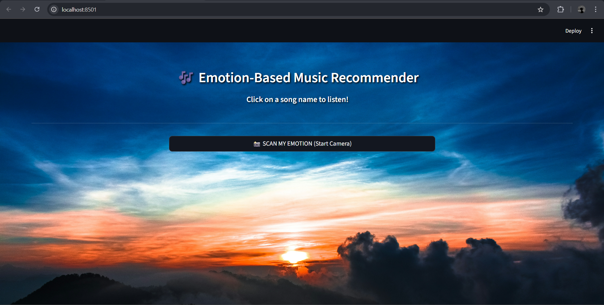
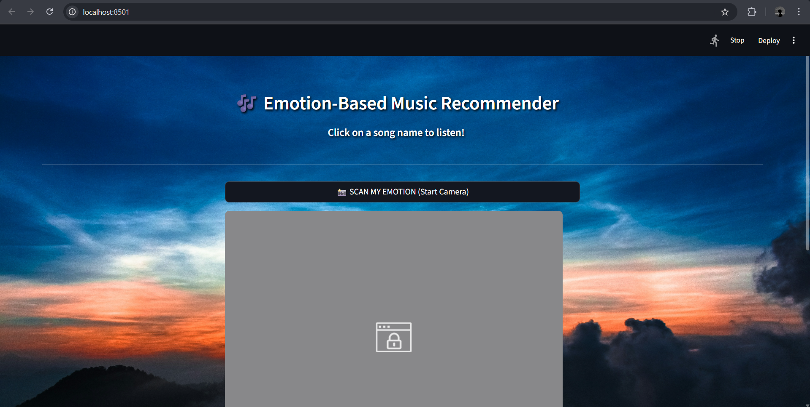
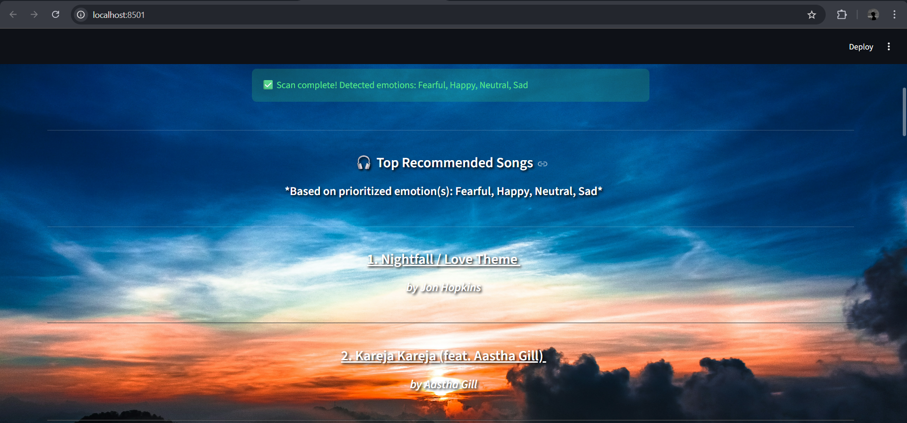

<<<<<<< HEAD
# Emotion-Based Music Recommendation System 🎶

This application detects a user’s facial emotion using real-time webcam input and recommends music based on emotional state. It combines computer vision (OpenCV), deep learning (TensorFlow/Keras), and a Streamlit UI.

---

## 📸 Example Screenshots

### App Home UI



### Emotion Detection (Camera Active)



### Music Recommendation Output



---

## ✨ Features

- Real-time facial emotion detection via Haar Cascade
- CNN-based 7-emotion classification
- Emotion → Music mapping across 5 emotional categories
- Efficient song sampling
- Clean Streamlit interface
- Uses session-state caching for performance

---

## 📁 Project Structure
=======
# 🎶 Emotion-Based Music Recommendation System

An AI-powered web application that detects a user’s **facial emotion in real time** using computer vision and deep learning, then recommends a **curated music playlist** matching the detected mood.

This project demonstrates practical **Affective Computing** by combining **OpenCV**, **CNN-based emotion classification**, and a **Streamlit web interface**.

---

## 📸 Demo & Screenshots

### 🏠 App Home UI
Clean, minimal interface built using Streamlit.


---

### 📷 Emotion Detection (Camera Active)
Real-time face detection and emotion classification using OpenCV and a trained CNN model.


---

### 🎵 Music Recommendation Output
Detected emotion is mapped to a mood category and corresponding songs are fetched.


---

## ✨ Key Features

- **Real-time Emotion Detection**  
  Uses Haar Cascade for instant face detection via webcam.
>>>>>>> 4b863135c863427cd02a0109b788ab24ca8eead3

- **Deep Learning Model**  
  CNN-based classifier categorizes faces into **7 distinct emotions**.

- **Smart Mood Mapping**  
  Emotions are mapped into **5 mood categories** for better music relevance.

- **Curated Playlists**  
  Song recommendations are fetched from the `muse_v3.csv` dataset.

- **Interactive Web UI**  
  Fully responsive Streamlit-based interface.

---

## 📁 Project Structure

```text
Emotion-based-music-recommendation-system/
│
<<<<<<< HEAD
├── app.py
├── requirements.txt
├── muse_v3.csv
├── model.h5
├── haarcascade_frontalface_default.xml
│
└── assets/
├── main_ui.png
├── scan.png
└── output.png
=======
├── app.py                         # Main Streamlit application
├── requirements.txt               # Python dependencies
├── muse_v3.csv                    # Music dataset
├── model.h5                       # Pre-trained CNN model
├── haarcascade_frontalface_default.xml  # OpenCV face detector
│
└── assets/                        # README screenshots
    ├── main_ui.png
    ├── scan.png
    └── output.png
```
>>>>>>> 4b863135c863427cd02a0109b788ab24ca8eead3

— this is the version you should paste into your README.

---

## 🖥️ Setup Instructions

### 1️⃣ Create virtual environment

<<<<<<< HEAD
**Windows:**
=======
Web Framework: Streamlit

Data Handling: Pandas, NumPy

🖥️ Setup & Installation
1️⃣ Clone the Repository
git clone https://github.com/PurveshShinde/Emotion-based-music-recommendation-system.git
cd Emotion-based-music-recommendation-system

2️⃣ Create a Virtual Environment (Recommended)

Windows
>>>>>>> 4b863135c863427cd02a0109b788ab24ca8eead3

```bash
python -m venv venv
<<<<<<< HEAD
macOS/Linux:
=======
venv\Scripts\activate


macOS / Linux
>>>>>>> 4b863135c863427cd02a0109b788ab24ca8eead3

bash
Copy code
python3 -m venv venv
2️⃣ Activate the environment
Windows:

bash
Copy code
venv\Scripts\activate
macOS/Linux:

bash
Copy code
source venv/bin/activate
<<<<<<< HEAD
3️⃣ Install dependencies
bash
Copy code
pip install -r requirements.txt
4️⃣ Run the application
bash
Copy code
=======

3️⃣ Install Dependencies
pip install -r requirements.txt

4️⃣ Run the Application
>>>>>>> 4b863135c863427cd02a0109b788ab24ca8eead3
streamlit run app.py
Then open:

<<<<<<< HEAD
arduino
Copy code
http://localhost:8501
🎥 Using the Camera
Click:
=======

The app will be available at:
👉 http://localhost:8501
>>>>>>> 4b863135c863427cd02a0109b788ab24ca8eead3

java
Copy code
📸 SCAN MY EMOTION (Start Camera)
Allow webcam access

<<<<<<< HEAD
Hold still for a few seconds

Your emotion will be detected

Songs will be recommended

🔥 Git Ignore Setup
Inside project root, create:

Copy code
.gitignore
Add:

Copy code
venv/
.venv/
If you mistakenly committed venv earlier:
=======
Launch the application.

Click 📸 SCAN MY EMOTION from the sidebar.

Allow webcam access in the browser.

Look at the camera for a few seconds.

View detected emotion and recommended songs.

⚙️ Configuration & Troubleshooting
.gitignore (Recommended)
venv/
.venv/
__pycache__/
.DS_Store
>>>>>>> 4b863135c863427cd02a0109b788ab24ca8eead3

bash
Copy code
git rm -r --cached venv
git rm -r --cached .venv
git commit -m "Removed venv from repo"
🧠 Requirements
Python 3.8+

<<<<<<< HEAD
Webcam

TensorFlow for inference

OpenCV for face detection

Streamlit for UI

Internet access for music links

🏁 Summary
This project demonstrates practical Affective Computing:

✔ Captures facial expressions
✔ Performs deep-learning-based emotion inference
✔ Maps emotion to curated music
✔ Displays results in an interactive UI

Ideal for:

AI/ML coursework

Computer Vision research

Real-time human-computer interaction demos
```
=======
Webcam not opening

Ensure no other applications (Zoom, Teams) are using the webcam.

Model file not found

Confirm model.h5 and haarcascade_frontalface_default.xml are in the root directory.

Slow first run

TensorFlow may take extra time to load the model initially.

🏁 Summary

This project showcases an end-to-end Emotion-Aware Recommendation System:

Facial expression capture using OpenCV

Emotion inference via Deep Learning

Intelligent mood-to-music mapping

Real-time interactive web experience

🎓 Ideal for:
AI/ML coursework, Computer Vision demos, Human–Computer Interaction (HCI), and portfolio projects.

📌 Future Improvements

Spotify / YouTube API integration

Emotion confidence visualization

Mobile-friendly UI

Model optimization for faster inference
>>>>>>> 4b863135c863427cd02a0109b788ab24ca8eead3
